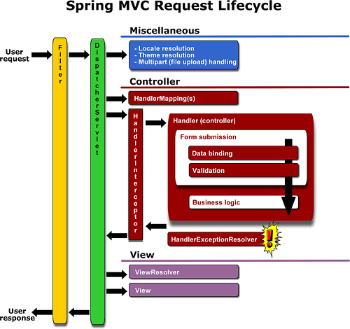

# Interceptor



- DispatcherServlet 에서 Interceptor를 거쳐서 Controller의 메소드가 실행된 후, 그 결과역시 Interceptor를 거친 후 ViewResolver로 결과가 전달된다.
- 쉽게 말해서 DispatcherServlet과 Controller사이에 있는 필터라고 말할 수 있다.

## 인터셉터를 추가한다.

- ServletContextConfig에 addInterceptors메소드를 오버라이딩한다.
- 파라미터로 전달받은 registry에 인터셉터를 추가한후,부모의 메소드를 호출한다.

```
    @Override
    public void addInterceptors(InterceptorRegistry registry) {
        registry.addInterceptor(new LoggingHandlerInterceptor());
        registry.addInterceptor(new LoginCheckInterceptor());
        super.addInterceptors(registry);
    }

```

## 인터셉터 클래스를 작성한다.

- 인터셉터 클래스는 보통 HandlerInterceptorAdapter클래스를 상속받아 작성한다.
- DispatcherServlet으로 부터 Controller에 값이 전달되기 전에 preHandle메소드가 호출된다.
- Controller의 메소드가 호출한 이후 그 결과를 DispatcherServlet으로 값이 전달되기 전에 postHandle메소드를 호출한다.

### LoggingHandlerInterceptor클래스 작성

- preHandle메소드에서 시간을 구한 후 request객체에 값을 저장한다. 부모의 preHandle메소드에 파라미터를 넘긴 후 그 값을 반환한다.
- postHandle메소드에서는 시간을 구한 후 request객체에 저장한 시간의 차이를 출력한다. (나중에 log4j 나 slf4j 등을 이용하여 로그를 남기도록 수정할 필요가 있다.)
- 왜 request객체에 값을 전달한 후 시간차를 출력할까? 컨트롤러 메소드는 동시에 여러개 호출될 수 있기 때문이다.


```
package carami.todo.intercepter;

import org.springframework.web.servlet.ModelAndView;
import org.springframework.web.servlet.handler.HandlerInterceptorAdapter;

import javax.servlet.http.HttpServletRequest;
import javax.servlet.http.HttpServletResponse;

public class LoggingHandlerInterceptor extends HandlerInterceptorAdapter {
    private static final String ATTRIBUTE_BEGIN_TIME = "ATTR_BEGIN_TIME";

    @Override
    public boolean preHandle(HttpServletRequest request, HttpServletResponse response, Object handler) throws Exception {

        Long currentTime = System.currentTimeMillis();
        request.setAttribute(ATTRIBUTE_BEGIN_TIME, currentTime);

        return super.preHandle(request, response, handler);
    }

    @Override
    public void postHandle(HttpServletRequest request, HttpServletResponse response, Object handler, ModelAndView modelAndView) throws Exception {

        long beginTime = (long) request.getAttribute(ATTRIBUTE_BEGIN_TIME);
        String uri = request.getRequestURI();
        String method = request.getMethod();

        StringBuilder stringBuilder = new StringBuilder();
        stringBuilder.append("[").append(method).append("] ");
        stringBuilder.append(uri).append(" ");
        stringBuilder.append(System.currentTimeMillis() - beginTime);
        stringBuilder.append(" ms");

        System.out.println(stringBuilder.toString());

        super.postHandle(request, response, handler, modelAndView);
    }
}

```

### LoginCheckInterceptor클래스 작성

- 사용자의 요청이 /loginpage일 경우 세션에 loginUser에 대항하는 값이 있을 경우 true를 반환하고 없을 경우는 false를 반환한다.
- false를 반환하기 전 /로 리다이렉트로 한다. 즉, 로그인하지 않은 사용자가 /loginpage를 요청할 경우에는 /로 리다이렉트된다.

```
package carami.todo.intercepter;

import carami.todo.dto.NaverLoginUser;
import org.springframework.web.servlet.handler.HandlerInterceptorAdapter;

import javax.servlet.http.HttpServletRequest;
import javax.servlet.http.HttpServletResponse;
import javax.servlet.http.HttpSession;

public class LoginCheckInterceptor extends HandlerInterceptorAdapter {
    @Override
    public boolean preHandle(HttpServletRequest request, HttpServletResponse response, Object handler) throws Exception {
        HttpSession session = request.getSession();
        NaverLoginUser naverLoginUser = (NaverLoginUser)session.getAttribute("loginUser");
        String path = request.getRequestURI();

        System.out.println("path : " + path);

        if("/loginpage".equals(path)){
            if(naverLoginUser == null){
                response.sendRedirect("/");
                return false;
            }
        }
        return true;
    }
}

```

loginpage.jsp

```
<%@ page contentType="text/html;charset=UTF-8" language="java" %>
<html>
<head>
    <title>loginpage</title>
</head>
<body>
<h1> LoginPage 입니다. 로그인하면 볼 수 있습니다.</h1>
</body>
</html>

```
