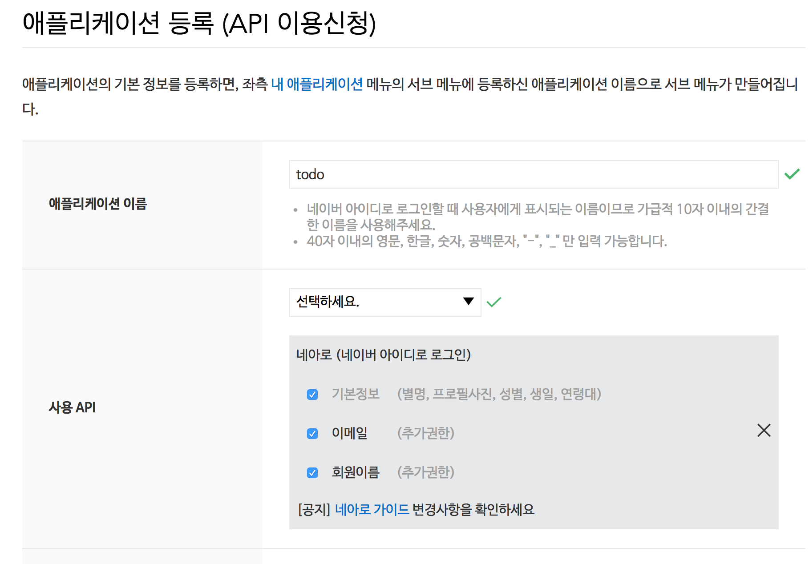
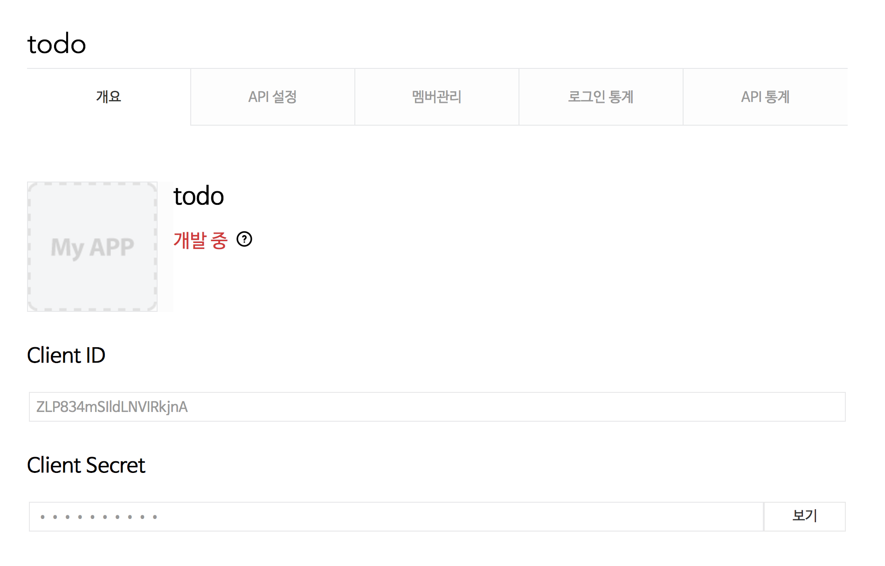
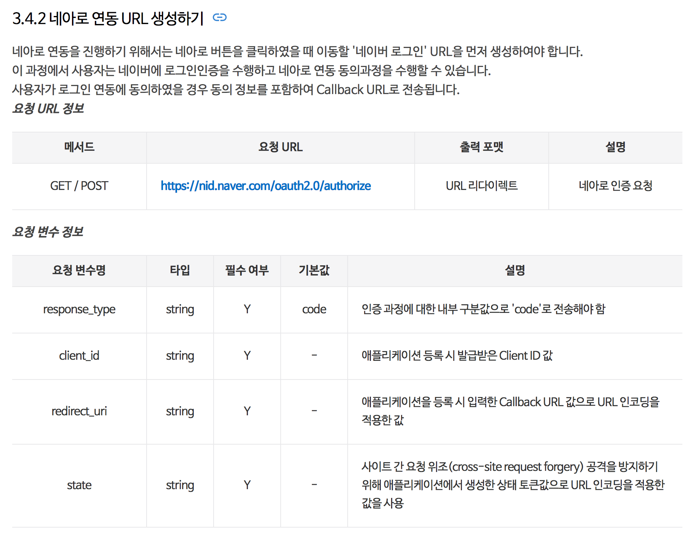

# Naver Login
## 일반적인 로그인


- 보통 웹 어플리케이션은 로그인 폼을 제공한 후, 사용자가 id,암호를 올바르게 입력하였다면 세션에 로그인 정보를 저장하고 로그인 성공 화면을 보여준다.
-	로그인한 사용자만 이용할 수 있는 URL에서는 세션에 올바른 값이 있는지 비교를 하게 된다.


## 네이버 로그인


## Naver에서 애플리케이션 등록

1. https://developers.naver.com/apps/#/list 에서 Application 등록버튼 클릭

2. 애플리케이션 정보 등록





3. 로그인, 사용자 정보등을 가지고 오기 위해서 Naver 문서를 참조한다

https://developers.naver.com/docs/login/devguide/

예제>
https://nid.naver.com/oauth2.0/authorize?response_type=code&client_id=CLIENT_ID&state=STATE_STRING&redirect_uri=CALLBACK_URL

로그인 버튼을 누르면 위의 URL로 요청이 간다.

- 네이버에 로그을을 하지 않은 상황이라면 todo 를 사용하려면 로그인 해야합니다 라는 메시지와 함께 id, password입력창이 보여진다. 아이디, 암호를 입력하여 로그인을 하면 todo앱에 어떤 정보를 제공하는지 보여준다.
  "동의하기"버튼을 클릭하게 되면 callback URL로 redirect하게 된다




- callBack으로 넘어온 정보를 출력하면 다음과 같다. 제대로 넘어왔는지 확인하기 위하여 Session에 저장해둔 state값과 파라미터로 넘어온 State값을 비교한다.
- code값은 네아로 인증에 성공하면 반환받는 인증 코드, 접근 토큰(access token) 발급에 사용됩니다.

>Header Values ----------------------------------
>host : localhost:8080
>connection : keep-alive
>cache-control : max-age=0
>upgrade-insecure-requests : 1
>user-agent : Mozilla/5.0 (Macintosh; Intel Mac OS X 10_12_5) AppleWebKit/537.36 (KHTML, like Gecko) Chrome/59.0.3071.115 >Safari/537.36
>accept : text/html,application/xhtml+xml,application/xml;q=0.9,image/webp,image/apng,*/*;q=0.8
>accept-encoding : gzip, deflate, br
>accept-language : ko,en-US;q=0.8,en;q=0.6
>cookie : Idea-6296546d=26b39535-a7fb-4ddc-8989-f3f7b4b66bb9; SCOUTER=xs2ri0r5003jj; >JSESSIONID=8B1C39C006177C355F532784D661C3E5
>request Values ----------------------------------
>code : v2p7b2jcu30CmeJ1
>state : 916882313730767219999586828602446552295


7. 로그아웃하기

 HelloController에 다음을 추가한다.

 ```
    @GetMapping(path = "/logout")
    public String logout(HttpServletRequest request){
        HttpSession session = request.getSession();
        session.removeAttribute("loginUser");
        return "redirect:/";
    }

```


8. 네이버로부터 읽어온 정보를 db에 저장하려면 어떻게 해야할까?       
