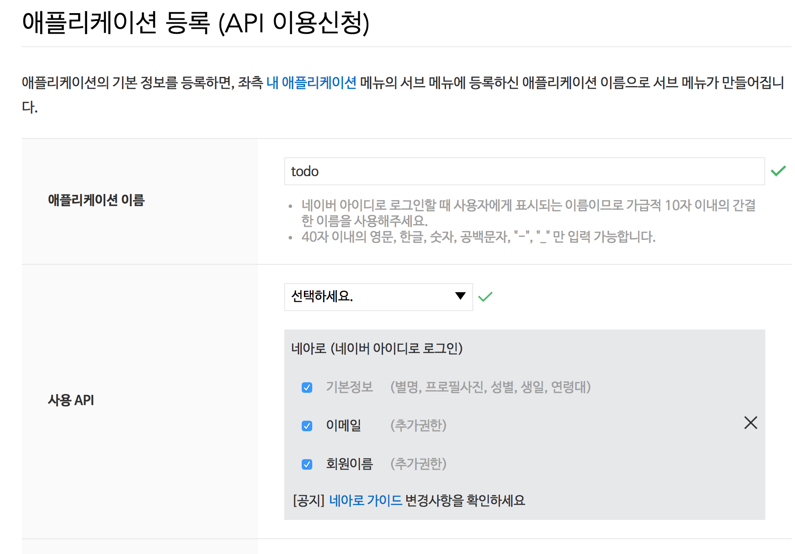
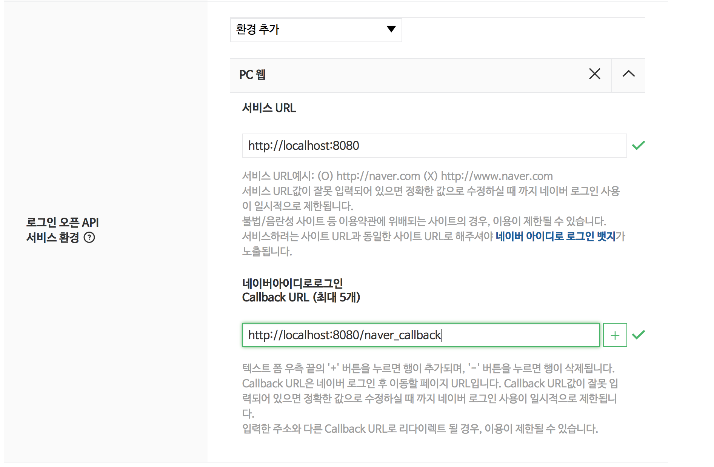
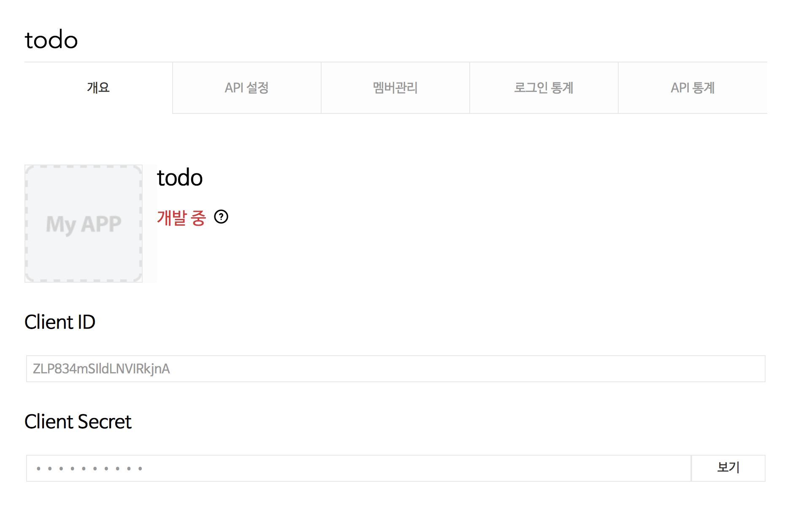
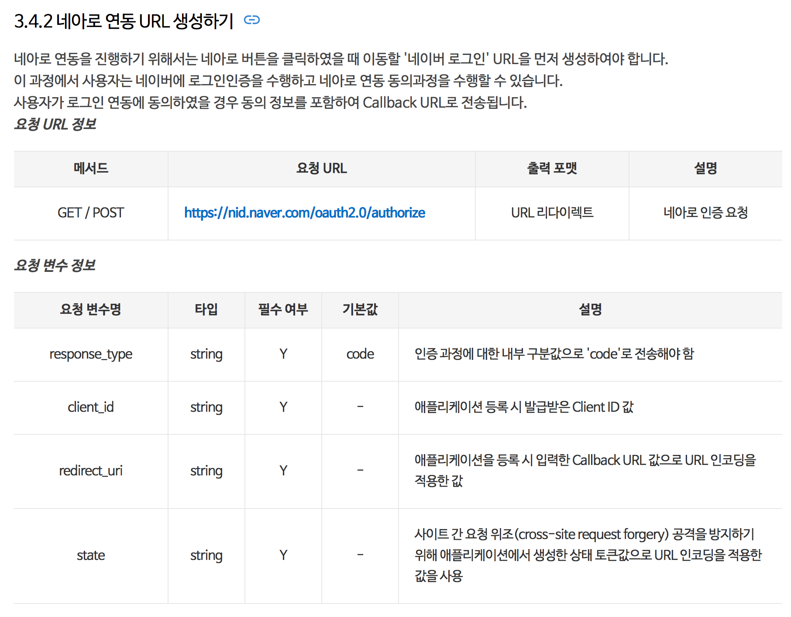
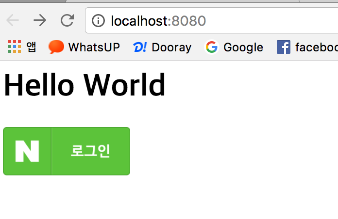
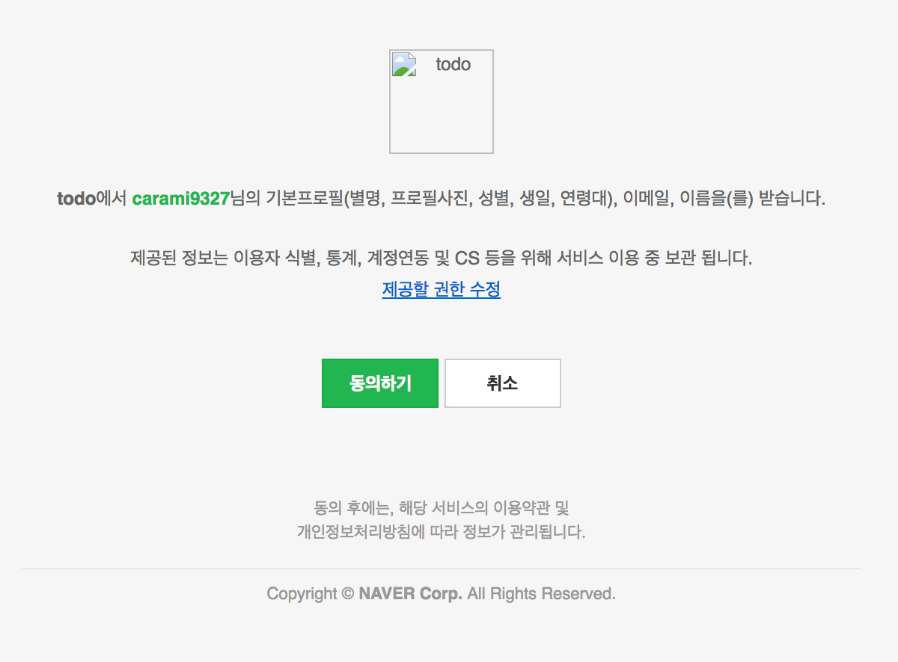
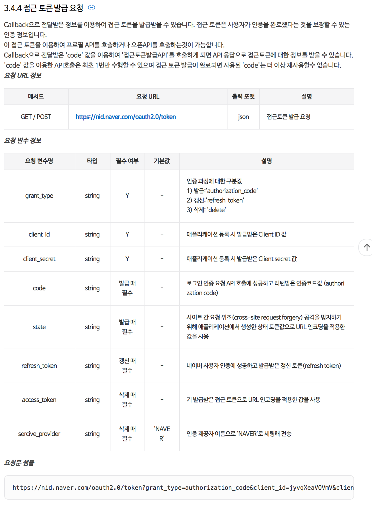
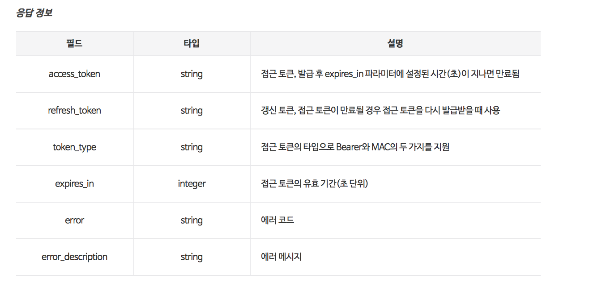
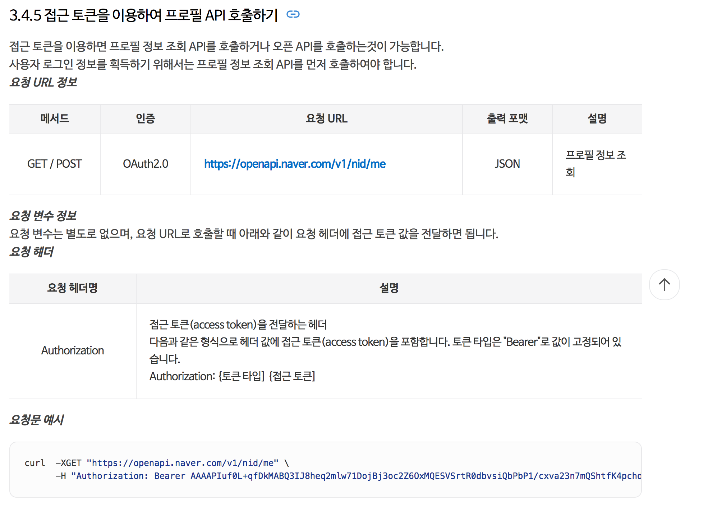
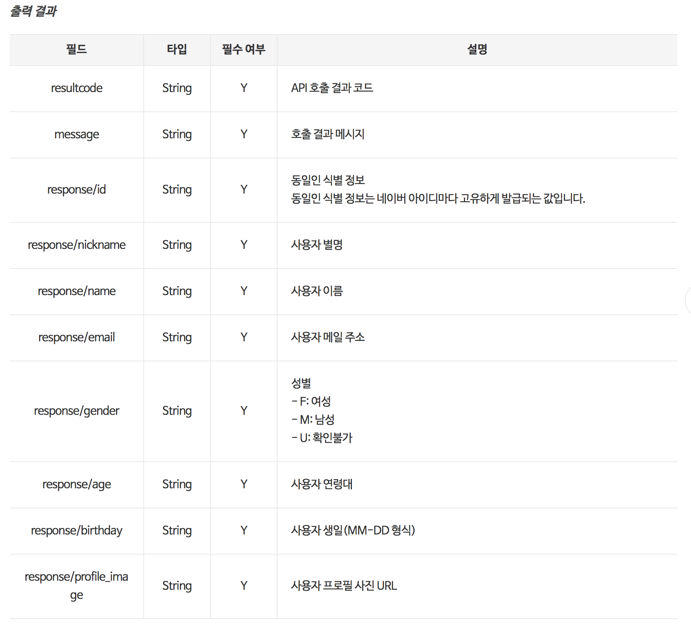

# Naver Login

## Naver에서 애플리케이션 등록

1. https://developers.naver.com/apps/#/list 에서 Application 등록버튼 클릭

2. 애플리케이션 정보 등록





3. 로그인, 사용자 정보등을 가지고 오기 위해서 Naver 문서를 참조한다

https://developers.naver.com/docs/login/devguide/

예제>
https://nid.naver.com/oauth2.0/authorize?response_type=code&client_id=CLIENT_ID&state=STATE_STRING&redirect_uri=CALLBACK_URL

로그인 버튼을 누르면 위의 URL로 요청이 간다.

- 네이버에 로그을을 하지 않은 상황이라면 todo 를 사용하려면 로그인 해야합니다 라는 메시지와 함께 id, password입력창이 보여진다. 아이디, 암호를 입력하여 로그인을 하면 todo앱에 어떤 정보를 제공하는지 보여준다.
  "동의하기"버튼을 클릭하게 되면 callback URL로 redirect하게 된다
  



  
- callBack으로 넘어온 정보를 출력하면 다음과 같다. 제대로 넘어왔는지 확인하기 위하여 Session에 저장해둔 state값과 파라미터로 넘어온 State값을 비교한다.
- code값은 네아로 인증에 성공하면 반환받는 인증 코드, 접근 토큰(access token) 발급에 사용됩니다.
Header Values ----------------------------------
host : localhost:8080
connection : keep-alive
cache-control : max-age=0
upgrade-insecure-requests : 1
user-agent : Mozilla/5.0 (Macintosh; Intel Mac OS X 10_12_5) AppleWebKit/537.36 (KHTML, like Gecko) Chrome/59.0.3071.115 Safari/537.36
accept : text/html,application/xhtml+xml,application/xml;q=0.9,image/webp,image/apng,*/*;q=0.8
referer : http://localhost:8080/naver_callback?code=v2p7b2jcu30CmeJ1&state=916882313730767219999586828602446552295
accept-encoding : gzip, deflate, br
accept-language : ko,en-US;q=0.8,en;q=0.6
cookie : Idea-6296546d=26b39535-a7fb-4ddc-8989-f3f7b4b66bb9; SCOUTER=xs2ri0r5003jj; JSESSIONID=8B1C39C006177C355F532784D661C3E5
request Values ----------------------------------
code : v2p7b2jcu30CmeJ1
state : 916882313730767219999586828602446552295

4. 네이버 로그인 1 단계. 로그인 후 callback호출하기.

4-1. hello.jsp 에 다음의 내용을 추가한다.

```
<a href="${naverLoginUrl}"></a>

```

네이버 이미지를 클릭하면 ${naverLoginUrl}로 이동한다. 위에서 말한 네이버 로그인 URL

4.2. HelloController를 다음과 같이 수정한다.

```
package carami.todo.controller;

import carami.todo.dto.NaverLoginUser;
import carami.todo.dto.NaverLoginUserResult;
import org.springframework.beans.factory.annotation.Autowired;
import org.springframework.beans.factory.annotation.Qualifier;
import org.springframework.core.ParameterizedTypeReference;
import org.springframework.http.*;
import org.springframework.stereotype.Controller;
import org.springframework.ui.Model;
import org.springframework.web.bind.annotation.GetMapping;
import org.springframework.web.bind.annotation.RequestParam;
import org.springframework.web.client.RestTemplate;

import javax.servlet.http.HttpServletRequest;
import javax.servlet.http.HttpSession;
import java.io.UnsupportedEncodingException;
import java.math.BigInteger;
import java.net.URLEncoder;
import java.security.SecureRandom;
import java.util.Enumeration;
import java.util.Map;

/**
 * Created by 강경미 on 2017. 6. 3..
 */
@Controller
public class HelloController {
    @Autowired
    @Qualifier("restTemplate")
    RestTemplate restTemplate;

    String clientId = "ZLP834mSIldLNVIRkjnA";//애플리케이션 클라이언트 아이디값";

    @GetMapping(path = "/")
    public String hello(HttpServletRequest request){
        String callbackUrl = "http://localhost:8080/naver_callback";
        String naverLoginUrl = getNaverLoginUrl(callbackUrl, request.getSession());
        request.setAttribute("naverLoginUrl", naverLoginUrl);
        return "hello";
    }

    @GetMapping(path = "/naver_callback")
    public String naverCallback(
            @RequestParam(name = "code")String code, @RequestParam(name = "state")String state,
            HttpServletRequest request){
//        Enumeration<String> headerNames = request.getHeaderNames();
//        System.out.println("Header Values ----------------------------------");
//        while(headerNames.hasMoreElements()){
//            String headerName = headerNames.nextElement();
//            String hedaerValue = request.getHeader(headerName);
//            System.out.println(headerName + " : " + hedaerValue);
//        }
//
//        System.out.println("request Values ----------------------------------");
//        Enumeration<String> parameterNames = request.getParameterNames();
//        while(parameterNames.hasMoreElements()){
//            String parameterName = parameterNames.nextElement();
//            String parameterValue = request.getParameter(parameterName);
//            System.out.println(parameterName + " : " + parameterValue);
//        }

        HttpSession session = request.getSession();
        String sessionState = (String)session.getAttribute("state"); // 세션에 저장된 state값 읽어오기
        if(!state.equals(sessionState)){ // clientId 혹은  state값이 올바르지 않을 경우
            throw new RuntimeException("잘못된 callback 입니다.");
        }

        Map<String, String> tokenMap = getToken(code, state);
        String accessToken = tokenMap.get("access_token");
        NaverLoginUser naverLoginUser = getNaverLoginUser(accessToken);
        System.out.println(naverLoginUser);

        return "hello";
    }


    private String getNaverLoginUrl(String redirectURI, HttpSession session){


        SecureRandom random = new SecureRandom();
        String state = new BigInteger(130, random).toString();
        String naverLoginUrl = "https://nid.naver.com/oauth2.0/authorize?response_type=code";
        naverLoginUrl += "&client_id=" + clientId;
        naverLoginUrl += "&redirect_uri=" + redirectURI;
        naverLoginUrl += "&state=" + state;
        session.setAttribute("state", state);

        return naverLoginUrl;
    }


    private NaverLoginUser getNaverLoginUser(String accessToken) {

        HttpHeaders headers = new HttpHeaders();
        headers.add(HttpHeaders.CONTENT_TYPE, MediaType.APPLICATION_JSON_VALUE);
        headers.add("Authorization", "Bearer " + accessToken);
        HttpEntity httpEntity = new HttpEntity<>(headers);

        StringBuilder urlBuilder = new StringBuilder("https://openapi.naver.com/v1/nid/me");

        Map<String, Object> map = null;
        try {
            ResponseEntity<NaverLoginUserResult> responseEntity = restTemplate.exchange(urlBuilder.toString(), HttpMethod.GET, httpEntity, new ParameterizedTypeReference<NaverLoginUserResult>(){});
            NaverLoginUser response = responseEntity.getBody().getResponse();

            return response;
        } catch (Exception e) {
            e.printStackTrace();
        }

        return null;
    }

    private Map<String, String> getToken(String code, String state){
        String clientSecret = "skdxMSMuII";//애플리케이션 클라이언트 시크릿값";

        String redirectURI = null;
        try {
            redirectURI = URLEncoder.encode("http://localhost:8080/naver_callback", "UTF-8");
        } catch (UnsupportedEncodingException e) {
            e.printStackTrace();
        }
        String apiURL;
        apiURL = "https://nid.naver.com/oauth2.0/token?grant_type=authorization_code&";
        apiURL += "client_id=" + clientId;
        apiURL += "&client_secret=" + clientSecret;
        apiURL += "&redirect_uri=" + redirectURI;
        apiURL += "&code=" + code;
        apiURL += "&state=" + state;

        HttpHeaders headers = new HttpHeaders();
        headers.add(HttpHeaders.CONTENT_TYPE, MediaType.APPLICATION_JSON_VALUE);
        HttpEntity httpEntity = new HttpEntity<>(headers);

        StringBuilder urlBuilder = new StringBuilder(apiURL);

        Map<String, String> map = null;
        try {
            ResponseEntity<Map<String, String>> responseEntity = restTemplate.exchange(urlBuilder.toString(), HttpMethod.GET, httpEntity, new ParameterizedTypeReference<Map<String,String>>(){});
            map = responseEntity.getBody();

            return map;
        } catch (Exception e) {
            e.printStackTrace();
        }

        return null;
    }

}

```
getNaverLoginUrl() 메소드는 redirectUrl을 전달받아서 naver login을 위한 url 문자열을 만든다. 그리고 session에 state값을 random하게 만들어 저장한다.
추후에 redirect_url에 파라미터로 넘어온 값과 비교하여 해당 url이 올바른지 검증하는 목적으로 사용된다.

/naver_callback 은 네이버에서 앱을 등록할 때 입력한 URL이다. 여기에서는 redirect되었을 때 네이버에서 어떤 값을 넘기는지 확인하는 용도로 사용해보았다.
code, state 값이 파라미터로 넘어오는 것을 알 수 있다. 2가지 값을 callback_url에서 확인해야한다.

5. 네이버 로그인 2단계. callback이 올바른지 확인하고 사용자 정보 읽어오기.

- 네이버에서 회원정보를 읽어오려면, 인증 후에 token을 발급받아야 합니다. URL객체나 RestTemplate을 이용
- 네이버로부터 Token을 받은 후에, 해당 Token을 이용하여 네이버 사용자 정보 api를 읽어와야 합니다.

5-1. RestTemplate등록하기

RootApplicationContextConfig 에 RestTemplate 객체를 등록합니다. RestTemplate객체는 rest api를 호출한 후, 그 결과값을 객체로 자동변환하는 기능을 가지고 있습니다.
보통 rest api는 json, xml 등의 결과를 반환합니다.혹은 byte배열이 전달 될 수도 있습니다. 이러한 다양한 결과를 변환하는 Converter를 설정하게 되어 있습니다.
그리고 실제로 브라우저처럼 api를 호출해야하는데요. 여기에서는 기본으로 제공하는 SimpleClinetHttpRequestFactory를 이용하고 있습니다.
```
package carami.todo.config;

import org.springframework.context.annotation.Bean;
import org.springframework.context.annotation.ComponentScan;
import org.springframework.context.annotation.Configuration;
import org.springframework.context.annotation.Import;
import org.springframework.http.MediaType;
import org.springframework.http.client.SimpleClientHttpRequestFactory;
import org.springframework.http.converter.ByteArrayHttpMessageConverter;
import org.springframework.http.converter.HttpMessageConverter;
import org.springframework.http.converter.ResourceHttpMessageConverter;
import org.springframework.http.converter.StringHttpMessageConverter;
import org.springframework.http.converter.json.MappingJackson2HttpMessageConverter;
import org.springframework.http.converter.support.AllEncompassingFormHttpMessageConverter;
import org.springframework.web.client.RestTemplate;

import java.util.ArrayList;
import java.util.Arrays;
import java.util.List;

@Configuration
@ComponentScan(basePackages = {
        "carami.todo.dao",
        "carami.todo.service"
})
@Import({DbConfig.class})
public class RootApplicationContextConfig {
    @Bean("restTemplate")
    public RestTemplate mailRestTemplate() {

        MappingJackson2HttpMessageConverter mappingJackson2HttpMessageConverter = new MappingJackson2HttpMessageConverter();
        mappingJackson2HttpMessageConverter.setSupportedMediaTypes(Arrays.asList(MediaType.APPLICATION_JSON));

        List<HttpMessageConverter<?>> messageConverters = new ArrayList<>();
        messageConverters.add(new ByteArrayHttpMessageConverter());
        messageConverters.add(new StringHttpMessageConverter());
        messageConverters.add(new ResourceHttpMessageConverter());
        messageConverters.add(new AllEncompassingFormHttpMessageConverter());
        messageConverters.add(mappingJackson2HttpMessageConverter);

        SimpleClientHttpRequestFactory simpleClientHttpRequestFactory = new SimpleClientHttpRequestFactory();
        simpleClientHttpRequestFactory.setConnectTimeout(3000);
        simpleClientHttpRequestFactory.setReadTimeout(15000);
        simpleClientHttpRequestFactory.setBufferRequestBody(false);


        RestTemplate restTemplate = new RestTemplate(simpleClientHttpRequestFactory);
        restTemplate.setMessageConverters(messageConverters);
        return restTemplate;
    }
}

```


5-2. HelloController 수정하기

- RestTemplate을 주입합니다.
```    
       @Autowired
       @Qualifier("restTemplate")
       RestTemplate restTemplate;```
```

- naver로부터 token을 얻기 위한 getToken 메소드를 추가합니다. 토큰을 얻을때는 callback으로 받은 code값과 시크릿값이 필요합니다.
이 시크릿 값이 유출이 되면 마치 내가 만든 앱이 요청한 것처럼 동작하는 코드를 만들수 있으니 유출되지 않도록 조심히야 합니다. 네이버에서도 기본은 ***** 으로 보여지고 있습니다.

ResponseEntity<Map<String, String>> responseEntity = restTemplate.exchange(urlBuilder.toString(), HttpMethod.GET, httpEntity, new ParameterizedTypeReference<Map<String,String>>(){});
            
위의 부분이 restTemplate을 이용하여 api를 호출한 후 그 결과값을 받는 예제입니다. 응답결과를 Map형태로 받는 것을 알 수 있습니다.


        

api의 응답 결과에 있는 access_token, refresh_token 등이 넘어오는 것을 알 수 있습니다.

- token을 얻었다면, 해당 token을 이용하여 사용자 정보를 읽어옵니다.getNaverLoginUser() 메소드는 사용자 정보를 읽어옵니다.


     


ResponseEntity<NaverLoginUserResult> responseEntity = restTemplate.exchange(urlBuilder.toString(), HttpMethod.GET, httpEntity, new ParameterizedTypeReference<NaverLoginUserResult>(){});
NaverLoginUser response = responseEntity.getBody().getResponse();

위의 코드는 RestTemplate을 이용하여 Naver사용자 정보를 읽어옵니다. naver api는 json형태로 값을 반환합니다. api문서를 보면 알수 있는데요.
해당 json값을 객체로 변환시키기 위해서 NaverLoginUserResult와 NaverLoginUser객체를 만들었습니다.


네이버 사용자 정보를 저장하기 위해 NaverLoginUserResult라는 객체를만들었습니다.
NaverLoginUserResult는 api를 성공적으로 읽었는지에 대한 정보(resultCode, message)와 실제 회원 정보를 가지고 있습니다.
실제 회원정보는 NaverLoginUser객체에 담겨져 있습니다.

실제로 로그인을 한 이후 가지고 온 결과값은 다음과 같습니다.

```
NaverLoginUser{email='carami9327@naver.com', nickname='별이엄마', profileImage='https://ssl.pstatic.net/static/pwe/address/img_profile.png', age='40-49', gender='F', id='8070696', name='강경미', birthday='11-04'}
```

```
package carami.todo.dto;

/**
 * Created by 강경미 on 2017. 4. 23..
 */
public class NaverLoginUserResult {
    private String resultCode;
    private String message;
    private NaverLoginUser response;

    public String getResultCode() {
        return resultCode;
    }

    public void setResultCode(String resultCode) {
        this.resultCode = resultCode;
    }

    public String getMessage() {
        return message;
    }

    public void setMessage(String message) {
        this.message = message;
    }

    public NaverLoginUser getResponse() {
        return response;
    }

    public void setResponse(NaverLoginUser response) {
        this.response = response;
    }
}


```

```
package carami.todo.dto;

import com.fasterxml.jackson.annotation.JsonProperty;

import java.io.Serializable;

/**
 * Created by 강경미 on 2017. 4. 23..
 */
public class NaverLoginUser implements Serializable{
    private String email;
    private String nickname;
    @JsonProperty("profile_image")
    private String profileImage;
    private String age;
    private String gender;
    private String id;
    private String name;
    private String birthday;

    public String getEmail() {
        return email;
    }

    public void setEmail(String email) {
        this.email = email;
    }

    public String getNickname() {
        return nickname;
    }

    public void setNickname(String nickname) {
        this.nickname = nickname;
    }

    public String getProfileImage() {
        return profileImage;
    }

    public void setProfileImage(String profileImage) {
        this.profileImage = profileImage;
    }

    public String getAge() {
        return age;
    }

    public void setAge(String age) {
        this.age = age;
    }

    public String getGender() {
        return gender;
    }

    public void setGender(String gender) {
        this.gender = gender;
    }

    public String getId() {
        return id;
    }

    public void setId(String id) {
        this.id = id;
    }

    public String getName() {
        return name;
    }

    public void setName(String name) {
        this.name = name;
    }

    public String getBirthday() {
        return birthday;
    }

    public void setBirthday(String birthday) {
        this.birthday = birthday;
    }

    @Override
    public String toString() {
        return "NaverLoginUser{" +
                "email='" + email + '\'' +
                ", nickname='" + nickname + '\'' +
                ", profileImage='" + profileImage + '\'' +
                ", age='" + age + '\'' +
                ", gender='" + gender + '\'' +
                ", id='" + id + '\'' +
                ", name='" + name + '\'' +
                ", birthday='" + birthday + '\'' +
                '}';
    }
}

```

```
package carami.todo.controller;

import carami.todo.dto.NaverLoginUser;
import carami.todo.dto.NaverLoginUserResult;
import org.springframework.beans.factory.annotation.Autowired;
import org.springframework.beans.factory.annotation.Qualifier;
import org.springframework.core.ParameterizedTypeReference;
import org.springframework.http.*;
import org.springframework.stereotype.Controller;
import org.springframework.ui.Model;
import org.springframework.web.bind.annotation.GetMapping;
import org.springframework.web.bind.annotation.RequestParam;
import org.springframework.web.client.RestTemplate;

import javax.servlet.http.HttpServletRequest;
import javax.servlet.http.HttpSession;
import java.io.UnsupportedEncodingException;
import java.math.BigInteger;
import java.net.URLEncoder;
import java.security.SecureRandom;
import java.util.Enumeration;
import java.util.Map;

/**
 * Created by 강경미 on 2017. 6. 3..
 */
@Controller
public class HelloController {
    @Autowired
    @Qualifier("restTemplate")
    RestTemplate restTemplate;

    String clientId = "ZLP834mSIldLNVIRkjnA";//애플리케이션 클라이언트 아이디값";

    @GetMapping(path = "/")
    public String hello(HttpServletRequest request){
        String callbackUrl = "http://localhost:8080/naver_callback";
        String naverLoginUrl = getNaverLoginUrl(callbackUrl, request.getSession());
        request.setAttribute("naverLoginUrl", naverLoginUrl);
        return "hello";
    }

    @GetMapping(path = "/naver_callback")
    public String naverCallback(
            @RequestParam(name = "code")String code, @RequestParam(name = "state")String state,
            HttpServletRequest request){
//        Enumeration<String> headerNames = request.getHeaderNames();
//        System.out.println("Header Values ----------------------------------");
//        while(headerNames.hasMoreElements()){
//            String headerName = headerNames.nextElement();
//            String hedaerValue = request.getHeader(headerName);
//            System.out.println(headerName + " : " + hedaerValue);
//        }
//
//        System.out.println("request Values ----------------------------------");
//        Enumeration<String> parameterNames = request.getParameterNames();
//        while(parameterNames.hasMoreElements()){
//            String parameterName = parameterNames.nextElement();
//            String parameterValue = request.getParameter(parameterName);
//            System.out.println(parameterName + " : " + parameterValue);
//        }

        HttpSession session = request.getSession();
        String sessionState = (String)session.getAttribute("state"); // 세션에 저장된 state값 읽어오기
        if(!code.equals(clientId) || !state.equals(sessionState)){ // clientId 혹은  state값이 올바르지 않을 경우
            throw new RuntimeException("잘못된 callback 입니다.");
        }

        Map<String, String> tokenMap = getToken(code, state);
        String accessToken = tokenMap.get("access_token");
        NaverLoginUser naverLoginUser = getNaverLoginUser(accessToken);
        System.out.println(naverLoginUser);

        return "hello";
    }


    private String getNaverLoginUrl(String redirectURI, HttpSession session){


        SecureRandom random = new SecureRandom();
        String state = new BigInteger(130, random).toString();
        String naverLoginUrl = "https://nid.naver.com/oauth2.0/authorize?response_type=code";
        naverLoginUrl += "&client_id=" + clientId;
        naverLoginUrl += "&redirect_uri=" + redirectURI;
        naverLoginUrl += "&state=" + state;
        session.setAttribute("state", state);

        return naverLoginUrl;
    }


    private NaverLoginUser getNaverLoginUser(String accessToken) {

        HttpHeaders headers = new HttpHeaders();
        headers.add(HttpHeaders.CONTENT_TYPE, MediaType.APPLICATION_JSON_VALUE);
        headers.add("Authorization", "Bearer " + accessToken);
        HttpEntity httpEntity = new HttpEntity<>(headers);

        StringBuilder urlBuilder = new StringBuilder("https://openapi.naver.com/v1/nid/me");

        Map<String, Object> map = null;
        try {
            ResponseEntity<NaverLoginUserResult> responseEntity = restTemplate.exchange(urlBuilder.toString(), HttpMethod.GET, httpEntity, new ParameterizedTypeReference<NaverLoginUserResult>(){});
            NaverLoginUser response = responseEntity.getBody().getResponse();

            return response;
        } catch (Exception e) {
            e.printStackTrace();
        }

        return null;
    }

    private Map<String, String> getToken(String code, String state){
        String clientSecret = "skdxMSMuII";//애플리케이션 클라이언트 시크릿값";

        String redirectURI = null;
        try {
            redirectURI = URLEncoder.encode("http://localhost:8080/naver_callback", "UTF-8");
        } catch (UnsupportedEncodingException e) {
            e.printStackTrace();
        }
        String apiURL;
        apiURL = "https://nid.naver.com/oauth2.0/token?grant_type=authorization_code&";
        apiURL += "client_id=" + clientId;
        apiURL += "&client_secret=" + clientSecret;
        apiURL += "&redirect_uri=" + redirectURI;
        apiURL += "&code=" + code;
        apiURL += "&state=" + state;

        HttpHeaders headers = new HttpHeaders();
        headers.add(HttpHeaders.CONTENT_TYPE, MediaType.APPLICATION_JSON_VALUE);
        HttpEntity httpEntity = new HttpEntity<>(headers);

        StringBuilder urlBuilder = new StringBuilder(apiURL);

        Map<String, String> map = null;
        try {
            ResponseEntity<Map<String, String>> responseEntity = restTemplate.exchange(urlBuilder.toString(), HttpMethod.GET, httpEntity, new ParameterizedTypeReference<Map<String,String>>(){});
            map = responseEntity.getBody();

            return map;
        } catch (Exception e) {
            e.printStackTrace();
        }

        return null;
    }

}


```